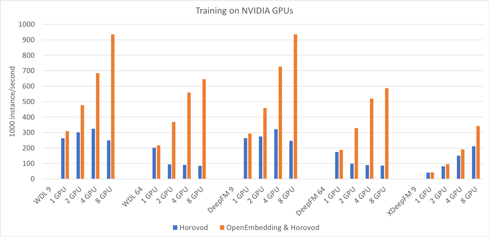

# OpenEmbedding

[](https://github.com/4paradigm/openembedding/actions/workflows/build.yml)
[](https://hub.docker.com/r/4pdosc/openembedding)
[](https://badge.fury.io/py/openembedding)
[](https://badge.fury.io/py/openembedding)
[](https://pepy.tech/project/openembedding)

English version | [中文版](README_cn.md)

## Table of Contents

- [OpenEmbedding](#openembedding)
  - [Table of Contents](#table-of-contents)
  - [About](#about)
  - [Benchmark](#benchmark)
  - [Features](#features)
  - [TODO](#todo)
  - [Install](#install)
  - [Docker](#docker)
  - [Quick Start](#quick-start)
  - [Build](#build)
    - [Docker Build](#docker-build)
    - [Native Build](#native-build)
  - [Designs](#designs)

## About

Openembedding is a distributed framework to accelerate TensorFlow training and support TensorFlow Serving. It uses the parameter server architecture to store the `Embedding` Layer. So that single machine memory is not the limit of model size. Openembedding can cooperate with all-reduce framework to support both data parallel and model parallel. Compared with using all-reduce only, OpenEmbedding can achieve more than 500% acceleration in some conditions.

## Benchmark



For models that contain sparse features, it is difficult to speed up using the all-reduce based framework Horovod, while using both OpenEmbedding and Horovod can get better acceleration effects. In the single 8 GPU scene, the speedup ratio is 3 to 8 times. Many models achieved 3 to 7 times the performance of Horovod.

- [Benchmark](documents/en/benchmark.md)

## Features

TensorFlow 2
- `dtype`: `float32`, `float64`
- `tensorflow.keras.initializers`
  - `RandomNormal`, `RandomUniform`, `Constant`, `Zeros`, `Ones`
  - The parameter `seed` is currently ignored
- `tensorflow.keras.optimizers`
  - `Adadelta`, `Adagrad`, `Adam`, `Adamax`, `Ftrl`, `RMSprop`, `SGD`
  - Not support `decay` and `LearningRateSchedule`
  - Not support `Adam(amsgrad=True)`
  - Not support `RMSProp(centered=True)`
  - The parameter server uses a sparse update method, which may cause different training results for the `Optimizer` with momentum
- `tensorflow.keras.layers.Embedding`
  - Support array for known `input_dim` and hash table for unknown `input_dim` (2**63 range)
  - Can still be stored on workers and use dense update method
  - Should not use `embeddings_regularizer`, `embeddings_constraint`
- tensorflow.keras.Model
  - Can be converted to distributed `Model` and automatically ignore or convert incompatible settings (such as `embeddings_constraint`)
  - Distributed `save`, `save_weights`, `load_weights` and `ModelCheckpoint`
  - Saving the distributed `Model` as a stand-alone SavedModel, which can be load by TensorFlow Serving
  - Not support training multiple distributed `Model`s in one task
- can collaborate with horovod, 'mirrored strategy' or 'multiworkermirroredstrategy'

## TODO

- Improve performance
- Support PyTorch training
- Support `tf.feature_column.embedding_column`
- Approximate `embedding_regularizer`, `LearningRateSchedule`, etc.
- Improve the support for `Initializer` and `Optimizer`
- Training multiple distributed `Model`s in one task 
- Support ONNX

## Install

```bash
pip3 install tensorflow horovod
pip3 install openembedding 
```
If you update TensorFlow, you need to reinstall OpenEmbedding
```bash
pip3 uninstall openembedding && pip3 install --no-cache-dir openembedding
```

## Docker

Run the GPU image using NVIDIA docker. The image can be obtained through [Docker Hub](https://hub.docker.com/r/4pdosc/openembedding/tags).
```bash
docker run --gpus all -it 4pdosc/openembedding:latest /bin/bash
```

After that, you can use openembedding for distributed training in docker. The following example can be run directly in docker.
```bash
# download data
mkdir -p tmp
wget -O tmp/dac_sample.tar.gz https://labs.criteo.com/wp-content/uploads/2015/04/dac_sample.tar.gz
tar -xzf tmp/dac_sample.tar.gz -C tmp

# preprocess
exec_test python3 examples/criteo_preprocess.py tmp/dac_sample.txt tmp/dac_sample.csv

# training
python3 examples/criteo_deepctr_network.py --data tmp/dac_sample.csv --batch_size 4096

# distributed training
horovodrun -np 2 python3 examples/criteo_deepctr_network.py --data tmp/dac_sample.csv --batch_size 4096
```

## Quick Start

The following is a simple example from off-line distributed training to online TensorFlow Serving.

Create `Model` and `Optimizer`.
```python
import tensorflow as tf
import deepctr.models import WDL
optimizer = tf.keras.optimizers.Adam()
model = WDL(feature_columns, feature_columns, task='binary')
```

Transform to distributed `Model` and distributed `Optimizer`. The `Embedding` layer will be stored on the parameter server.
```python
import horovod as hvd
import openembedding as embed
hvd.init()

optimizer = embed.distributed_optimizer(optimizer)
optimizer = hvd.DistributedOptimizer(optimizer)

model = embed.distributed_model(model)
```

Data parallelism by Horovod.
```python
model.compile(optimizer, "binary_crossentropy", metrics=['AUC'],
              experimental_run_tf_function=False)
callbacks = [ hvd.callbacks.BroadcastGlobalVariablesCallback(0),
              hvd.callbacks.MetricAverageCallback() ]
model.fit(dataset, epochs=10, verbose=2, callbacks=callbacks)
```

Export as a stand-alone SavedModel so that can be loaded by TensorFlow Serving.
```python
if hvd.rank() == 0:
    # Must specify include_optimizer=False explicitly
    model.save_as_original_model('model_path', include_optimizer=False)
```

More examples as follows.
- [Replace `Embedding` layer](examples/criteo_deepctr_hook.py)
- [Transform Network Model](examples/criteo_deepctr_network.py)
- [Custom Subclass Model](examples/criteo_lr_subclass.py)
- [With TensorFlow mirrored strategy](examples/criteo_deepctr_network_mirrored.py)

```bash
# Try stand-alone training
python3 examples/criteo_deepctr_network.py

# Distributed training with checkpoint
horovodrun -np 2 python3 examples/criteo_deepctr_network.py --checkpoint tmp/epoch

# Restore from epoch 4, training with more workers, and export as a stand-alone TensorFlow SavedModel
horovodrun -np 3 python3 examples/criteo_deepctr_network.py --load tmp/epoch4/variables/variables --export tmp/serving

# Use TensorFlow Serving image to load the SavedModel
docker pull tensorflow/serving
docker run --name serving-test -td -p 8500:8500 -p 8501:8501 \
    -v `pwd`/tmp/serving:/models/criteo/1 -e MODEL_NAME=criteo tensorflow/serving

# Get the prediction result by TensorFlow Serving gRPC client
python3 examples/tensorflow_serving_client.py
# Get prediction results by TensorFlow Serving restful API 
python3 examples/tensorflow_serving_restful.py

# Clear docker
docker stop serving-test
docker rm serving-test
```

## Build

### Docker Build

```
docker build -t 4pdosc/openembedding-base:0.1.0 -f docker/Dockerfile.base .
docker build -t 4pdosc/openembedding:0.0.0-build -f docker/Dockerfile.build .
```

### Native Build

The `g++` version needs to be compatible with `tf.version.COMPILER_VERSION` (>= 7), and install all [prpc](https://github.com/4paradigm/prpc) dependencies to `tools` or `/usr/local`, and then run `build.sh` to complete the compilation. The `build.sh` will automatically install prpc (pico-core) and parameter-server (pico-ps) to the `tools` directory.

```bash
git submodule update --init --checkout --recursive
pip3 install tensorflow
./build.sh clean && ./build.sh build
pip3 install ./build/openembedding-*.tar.gz
```

## Designs

- [Training](documents/en/training.md)
- [Serving](documents/en/serving.md)
