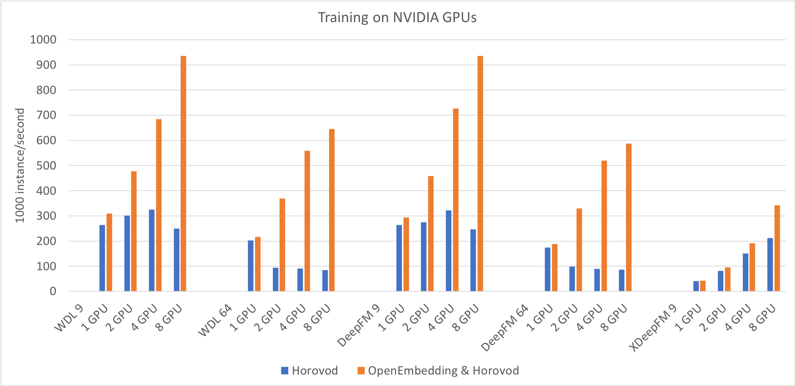

# OpenEmbedding

[](https://github.com/4paradigm/openembedding/actions/workflows/build.yml)
[](https://hub.docker.com/r/4pdosc/openembedding)
[](https://badge.fury.io/py/openembedding)
[](https://badge.fury.io/py/openembedding)
[](https://pepy.tech/project/openembedding)

[English version](README.md) | 中文版

## 关于

OpenEmbedding 是一个加速 TensorFlow 训练的分布式框架，同时支持 TensorFlow Serving 。OpenEmbedding 使用参数服务器架构存储 `Embedding` 层，使得单机内存不再成为模型大小的限制。OpenEmbedding 能够与基于 all-reduce 的分布式框架配合，相对于单独使用 all-reduce，在一些场景下可以获得 500% 以上的提速。

## 性能测试



对于包含稀疏特征的模型，仅使用基于 all-reduce 的 Horovod 难以得到加速，而同时使用 OpenEmbedding 和 Horovod 能得到更好的加速效果，在单机 8 GPU 场景取得了 3 到 8 倍的加速比，许多模型达到了 Horovod 3 到 7 倍的性能。

- [Benchmark 详情](documents/cn/benchmark.md)

## 安装使用

您可以通过以下步骤来安装并使用 OpenEmbedding 。这些示例展示了从使用 OpenEmbedding 训练 [criteo](https://labs.criteo.com/2014/09/kaggle-contest-dataset-now-available-academic-use/) 数据到使用 Tensorflow Serving 进行预测的整体流程。

### Docker

在镜像中使用 GPU 需要 NVIDIA docker，OpenEmbedding 镜像可通过 [Docker Hub](https://hub.docker.com/r/4pdosc/openembedding/tags)获取。

```bash
# "criteo_deepctr_stanalone.sh" 会训练并把模型导出到 "tmp/criteo/1"。
# 可以被替换为：
#    "criteo_deepctr_horovod.sh" (使用 Horovod 进行多卡训练)，
#    "criteo_deepctr_mirrored.sh" (使用 MirroredStrategy 进行多卡训练)，
#    "criteo_deepctr_mpi.sh" (使用 MultiWorkerMirroredStrategy 和 MPI 进行多卡训练)。
docker run --rm --gpus all -v /tmp/criteo:/openembedding/tmp/criteo \
    4pdosc/openembedding:latest examples/run/criteo_deepctr_standalone.sh 

# 启动 Tensorflow Serving 并加载训练的模型。
docker run --name serving-example -td -p 8500:8500 -p 8501:8501 \
        -v /tmp/criteo:/models/criteo -e MODEL_NAME=criteo tensorflow/serving:latest
# 等待服务器启动。
sleep 5

# 发送请求并得到预测结果。
docker run --rm --network host 4pdosc/openembedding:latest examples/run/criteo_deepctr_restful.sh

# 清理 docker。
docker stop serving-example
docker rm serving-example
```

### Ubuntu

```bash
# 安装 OpenEmbedding 需要的依赖。
apt update && apt install -y gcc-7 g++-7 python3 libpython3-dev python3-pip
pip3 install --upgrade pip
pip3 install tensorflow==2.5.1
pip3 install openembedding

# 安装示例程序需要的依赖。
apt install -y git cmake mpich curl 
HOROVOD_WITHOUT_MPI=1 pip3 install horovod
pip3 install deepctr pandas scikit-learn mpi4py

# 下载示例程序。
git clone https://github.com/4paradigm/OpenEmbedding.git
cd OpenEmbedding

# "criteo_deepctr_stanalone.sh" 会训练并把模型导出到 "tmp/criteo/1"。
# 可以被替换为：
#    "criteo_deepctr_horovod.sh" (使用 Horovod 进行多卡训练)，
#    "criteo_deepctr_mirrored.sh" (使用 MirroredStrategy 进行多卡训练)，
#    "criteo_deepctr_mpi.sh" (使用 MultiWorkerMirroredStrategy 和 MPI 进行多卡训练)。
examples/run/criteo_deepctr_standalone.sh 

# 启动 Tensorflow Serving 并加载训练的模型。
docker run --name serving-example -td -p 8500:8500 -p 8501:8501 \
        -v `pwd`/tmp/criteo:/models/criteo -e MODEL_NAME=criteo tensorflow/serving:latest
# 等待服务器启动。
sleep 5

# 发送请求并得到预测结果。
examples/run/criteo_deepctr_restful.sh

# 清理 docker.
docker stop serving-example
docker rm serving-example
```

### CentOS

```bash
# 安装 OpenEmbedding 需要的依赖。
yum install -y centos-release-scl
yum install -y python3 python3-devel devtoolset-7
scl enable devtoolset-7 bash
pip3 install --upgrade pip
pip3 install tensorflow==2.5.1
pip3 install openembedding

# 安装运行示例程序需要的依赖。
yum install -y git cmake mpich curl 
HOROVOD_WITHOUT_MPI=1 pip3 install horovod
pip3 install deepctr pandas scikit-learn mpi4py

# 下载示例程序。
git clone https://github.com/4paradigm/OpenEmbedding.git
cd OpenEmbedding

# "criteo_deepctr_stanalone.sh" 会训练并把模型导出到 "tmp/criteo/1"。
# 可以被替换为：
#    "criteo_deepctr_horovod.sh" (使用 Horovod 进行多卡训练)，
#    "criteo_deepctr_mirrored.sh" (使用 MirroredStrategy 进行多卡训练)，
#    "criteo_deepctr_mpi.sh" (使用 MultiWorkerMirroredStrategy 和 MPI 进行多卡训练)。
examples/run/criteo_deepctr_standalone.sh 

# 启动 Tensorflow Serving 并加载训练的模型。
docker run --name serving-example -td -p 8500:8500 -p 8501:8501 \
        -v `pwd`/tmp/criteo:/models/criteo -e MODEL_NAME=criteo tensorflow/serving:latest
# 等待服务器启动。
sleep 5

# 发送请求并得到预测结果。
examples/run/criteo_deepctr_restful.sh

# 清理 docker.
docker stop serving-example
docker rm serving-example
```

### 补充说明

安装时通常需要 g++ 7 以上版本，或者兼容 `tf.version.COMPILER_VERSION` 的编译器。可以通过环境变量 `CC` 和 `CXX` 来指定要使用的编译器。目前 OpenEmbedding 只能安装在 linux 系统上。
```bash
CC=gcc CXX=g++ pip3 install openembedding 
```

如果更新了 TensorFlow 则需要重新安装 OpenEmbedding。
```bash
pip3 uninstall openembedding && pip3 install --no-cache-dir openembedding
```

## 用户指南

一个常见使用方法的演示程序如下。

创建 Model 和 Optimizer。
```python
import tensorflow as tf
import deepctr.models import WDL
optimizer = tf.keras.optimizers.Adam()
model = WDL(feature_columns, feature_columns, task='binary')
```

转化为分布式的 Model 和 Optimizer，转化后会将其中的 `Embedding` 层存储在参数服务器上。
```python
import horovod as hvd
import openembedding.tensorflow as embed
hvd.init()

optimizer = embed.distributed_optimizer(optimizer)
optimizer = hvd.DistributedOptimizer(optimizer)

model = embed.distributed_model(model)
```
这里使用 `embed.distributed_optimizer` 将 TensorFlow 的优化器转化为支持参数服务器的优化器，从而能够更新参数服务器上的参数。 `embed.distributed_model` 的功能是替换模型中的 `Embedding` 并重写方法支持分布式的模型保存和加载，`Embedding.call` 会从参数服务器上拉取参数，同时注册了反向传播函数把梯度推送给参数服务器。

使用 Horovod 实现数据并行。
```python
model.compile(optimizer, "binary_crossentropy", metrics=['AUC'],
              experimental_run_tf_function=False)
callbacks = [ hvd.callbacks.BroadcastGlobalVariablesCallback(0),
              hvd.callbacks.MetricAverageCallback() ]
model.fit(dataset, epochs=10, verbose=2, callbacks=callbacks)
```

导出为单机 SavedModel，使 TensorFlow Serving 可以直接加载。
```python
if hvd.rank() == 0:
    # 必须指定 include_optimizer=False，不支持导出 optimizer
    model.save_as_original_model('model_path', include_optimizer=False)
```

更多的使用方法可以参考下面的内容。
- [替换 Embedding](examples/criteo_deepctr_hook.py)
- [转换 Network Model](examples/criteo_deepctr_network.py)
- [自定义 Subclass Model](examples/criteo_lr_subclass.py)
- [使用 TensorFlow 镜像策略](examples/criteo_deepctr_network_mirrored.py)
- [使用 TensorFlow 多工作器镜像策略和 MPI](examples/criteo_deepctr_network_mpi.py)

## 编译

### 使用 Docker 编译

```
docker build -t 4pdosc/openembedding-base:0.1.0 -f docker/Dockerfile.base .
docker build -t 4pdosc/openembedding:0.0.0-build -f docker/Dockerfile.build .
```

### 本机编译

编译器需要能够兼容 `tf.version.COMPILER_VERSION` (>= 7)，并且安装所有 [prpc](https://github.com/4paradigm/prpc) 的依赖到 `tools` 或 `/usr/local`，然后运行 `build.sh` 完成编译。`build.sh` 会自动安装 prpc (pico-core) 和 parameter-server (pico-ps) 到 `tools` 目录。

```bash
git submodule update --init --checkout --recursive
pip3 install tensorflow
./build.sh clean && ./build.sh build
pip3 install ./build/openembedding-*.tar.gz
```

## 功能特性

TensorFlow 2
- `dtype`: `float32`, `float64`。
- `tensorflow.keras.initializers`
  - `RandomNormal`, `RandomUniform`, `Constant`, `Zeros`, `Ones`
  - 目前会忽略参数 `seed`。
- `tensorflow.keras.optimizers`
  - `Adadelta`, `Adagrad`, `Adam`, `Adamax`, `Ftrl`, `RMSprop`, `SGD`。
  - 不支持 `decay` 和 `LearningRateSchedule`。
  - 不支持 `Adam(amsgrad=True)`。
  - 不支持 `RMSprop(centered=True)`。
  - 参数服务器使用了稀疏的更新方法，对于带有动量的 `Optimizer` 可能会导致不同的训练结果。
- `tensorflow.keras.layers.Embedding`
  - 支持已知的 `input_dim` 和未知的 `input_dim` (2**63 范围)。
  - 可以仍然存储在 worker 上并使用稠密的更新方法。
  - 不应使用 `embeddings_regularizer`, `embeddings_constraint`。
- `tensorflow.keras.Model`
  - 可以转换为分布式 Model 并自动忽略或转化不兼容的设置（如 `embeddings_constraint`）。
  - 分布式的 `save`, `save_weights`, `load_weights` 和 `ModelCheckpoint`。
  - 将分布式 `Model` 保存为单机的 SavedModel，可以被 TensorFlow Serving 直接使用。
  - 不支持在一个任务中训练多个分布式 `Model`。
- 可以与 Horovod 协作, 目前实验性支持 `MirroredStrategy` 或 `MultiWorkerMirroredStrategy` 。

## 后续工作

- 进一步优化性能
- 支持 PyTorch 训练
- 支持 `tf.feature_column.embedding_column`
- 近似的 `embedding_regularizer`, `LearningRateSchedule` 等
- 进一步完善对 `Initailizer` 和 `Optimizer` 的支持
- 能够在一个任务中训练多个分布式 `Model`
- 支持 ONNX

## 设计

- [Training](documents/cn/training.md)
- [Serving](documents/cn/serving.md)

## 论文

- [OpenEmbedding: A Distributed Parameter Server for Deep Learning Recommendation Models using Persistent Memory](documents/papers/openembedding_icde2023.pdf). Cheng Chen, Yilin Wang, Jun Yang, Yiming Liu, Mian Lu, Zhao Zheng, Bingsheng He, Weng-Fai Wong, Liang You, Penghao Sun, Yuping Zhao, Fenghua Hu, and Andy Rudoff. In 2023 IEEE 39rd International Conference on Data Engineering (ICDE) 2023.
