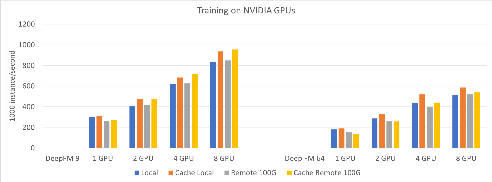

# 性能测试

## 单机多卡

在单机多卡的环境下，对比仅使用 Horovod 和 OpenEmbedding & Horovod 对 TensorFlow 的加速效果。

| 选项 | 设置 |
| - | - |
| CPU | 2 * CPU Xeon(R) Gold 5218 CPU @ 2.30GHz |
| GPU | 8 * Tesla T4 |
| 数据集 | Criteo |
| 数据格式 | TFRecord |
| Model | WDL, DeepFM, XDeepFM |
| Embedding维度 | 9, 64 |
| Optimizer | Adagrad |
| Batch Size per GPU | 4096 |

随着 GPU 数量的增加，仅使用 Horovod 难以得到加速，对于稀疏部分占比更大的 WDL 64, DeepFM 64 性能还会反而下降。对于 XDeepFM 9，由于模型计算量特别大，稀疏部分占比相对较小，Horovod 仍然能得到较好的加速，但是当 GPU 数量增多时，与 OpenEmbedding & Horovod 的差距就越来越大了。由于 XDeepFM 64 计算量极大，用时过长，这里没有测试。

## 分离参数服务器

> 在上一节中，OpenEmbedding & Horovod 实际上使用的是本节中 Cache Local 的设置。

| 测试名称 | 测试模式 |
| - | - |
| Local | Server 在本地 |
| Cache Local | Server 在本地，且高频 Embedding 视为稠密参数，使用 all-reduce 同步 |
| Remote 100G | Server 在远程，与 Worker 通过 100G bit/s 网络互联 |
| Cache Remote 100G | Server 在远程，与 Worker 通过 100G bit/s 网络互联，其他同 Cache Local |

在 100G 网络中，Server 与 Worker 之间的通信不会对性能造成很大影响。另外，使用 Cache 通常能够得到 10% 左右的加速。

## 大规模数据

OpenEmbedding 具备处理超大规模的数据的能力，对于大规模数据中的稀疏特征，有时难以去重并重新编号，在 OpenEmbedding 中可以将其 hash 到 int64 的非负整数范围，Server 会使用 hash table 存储参数。

1TB 的 Criteo 数据集的性能测试结果如下。

| | |
| - | - |
| Model | DeepFM 9 |
| Optimizer | Adagrad |
| 测试模式 | Remote |
| 数据集 | Criteo1T |
| 数据格式 | TSV |
| 每轮 Instance 数量 | 3.3 G |
| 训练速度 | 692 kips |
| 每轮用时 | 4763 s |
| Checkpoint 用时 | 869 s |
| Server 最大内存 | 1 * 175 GB |
| Worker 最大内存 | 8 * 1.6 GB |
| Checkpoint 大小 | 78 GB |
| SavedModel 大小 | 45 GB |

# 测试步骤

## 单机多卡

1. copy 出 test/benchmark 和 example/criteo_preprocess.py
2. 下载并解压 Criteo 数据集，得到 `train.txt` 约 11 GB
3. 预处理 `python3 criteo_preprocess.py train.txt train.csv` 
4. 转换为 TFRecord 格式 `mkdir -p tfrecord && python3 criteo_tfrecord.py train.csv 0 1` 如果转换过程较慢，这一步可以并行执行，详见 `criteo_tfrecord.py`
5. 测试 Horovod 2 GPU `horovodrun -np 2 python3 criteo_deepctr.py --data tfrecord`
6. 测试 OpenEmbedding & Horovod 2 GPU `horovodrun -np 2 python3 criteo_deepctr.py --data tfrecord --server`

## 分离参数服务器

两台机器的 ip 分别是 ip1 和 ip2。
1. 启动 Server `python3 server.py ip2:34567`
2. 启动 Worker `python3 criteo_deepctr.py --data tfrecord --server --cache --master_endpoint ip2:34567 --bind_ip ip1`

## 大规模数据

1. 下载并解压 Criteo 1TB 的数据放到 criteo1T 文件夹下，文件路径为 criteo1T/day_*
2. 在另一台机器 ip1 上执行 `python3 server.py ip1:34567`
3. 执行 `horovodrun -np 8 python3 criteo_deepctr.py --data criteo1T --server --master_endpoint ip1:34567`

可以使用 `--checkpoint`, `--save` 等参数指定模型保存路径，注意包括 `--data` 在内所有路径都应是共享的路径，不同机器之间可以通过挂载分布式文件系统来共享路径。

