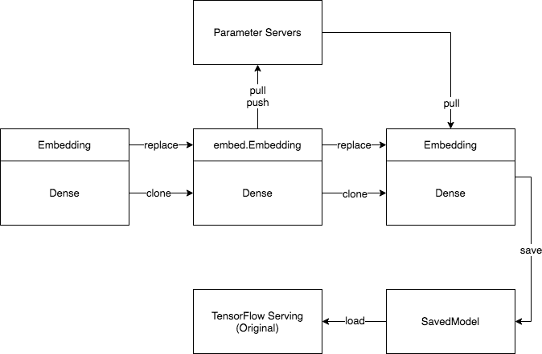
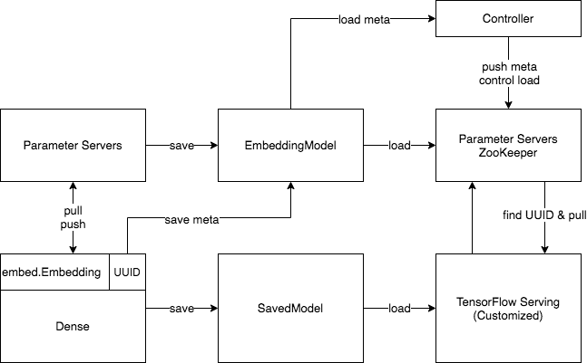

# Serving

## 单机模型

用户可以通过 `save_as_orignal_model` 将分布式 Model 保存为单机的 SavedModel。SavedModel 包含前向计算图和包括 Embedding 在内的所有参数，可以被 TensorFlow Serving 直接加载。这个 SavedModel 不能用于训练，因为它没有存储 `Optimizer` 状态。

## 分布式模型

分布式 Model 需要使用包含 OpenEmbedding Operator 的 TensorFlow Serving 才能加载，启动流程如下：
1. 启动参数服务器集群，包括 ZooKeeper Master, Server, Controller。
2. 通过 Controller 将 EmbeddingModel 加载到参数服务器上。
3. 启动 TensorFlow Serving 加载 SavedModel 并连接到参数服务器的 ZooKeeper Master。

在 SavedModel 中存储了一个 UUID 用于维护 SavedModel 和 EmbeddingModel 的对应关系。如果参数服务器上没有找到对应的 EmbeddingModel，Tensorflow Serving 会返回 "not found model"，而不会引发其他异常。