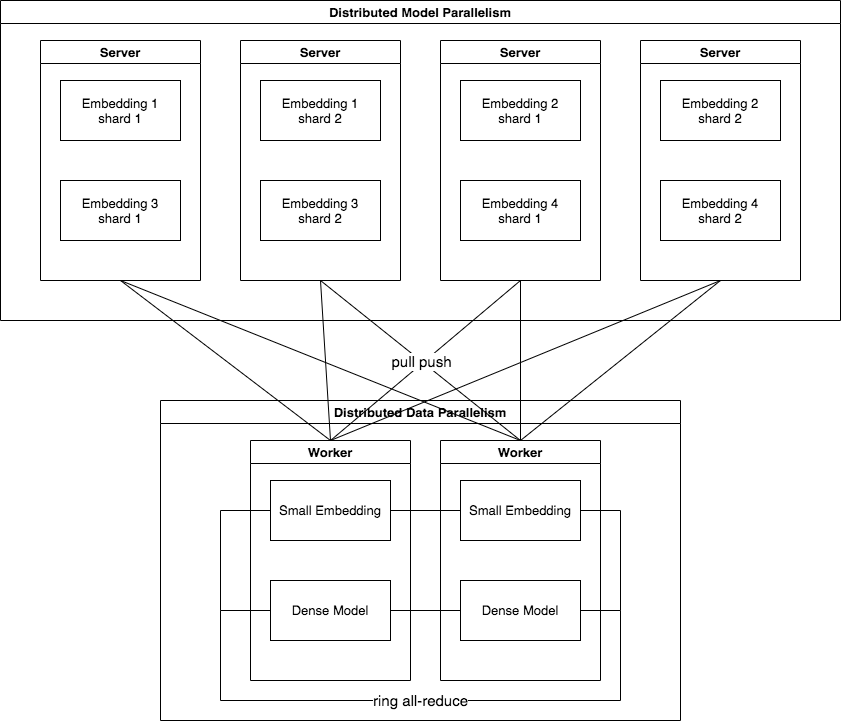

# Training

## 数据并行和模型并行

训练的并行模式如上图，稠密部分和高频 `Embedding` 参数 在每个 Worker 中都存储一个副本，通过 all-reduce 同步，实现数据并行。低频的 Embedding 分 shard 存储在 Server 上，实现模型并行。基于同步模式的参数服务器架构，Worker 从 Server 上 pull 参数并且将梯度 push 给 Server，Server 收集到一个 mini-batch 中所有 Worker 的梯度后使用 `Optimizer` 更新参数。
