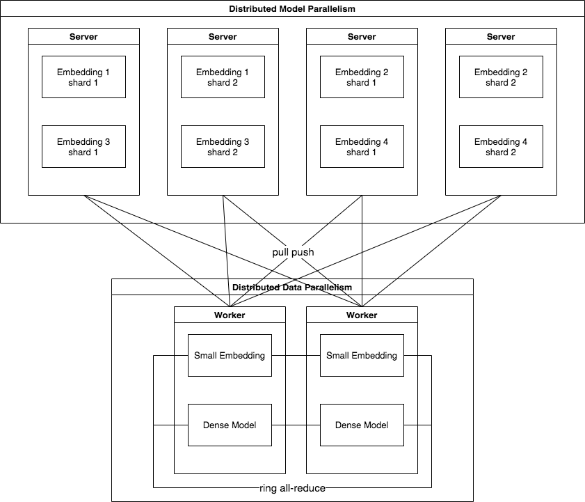

# Training

## Model parallel and data parallel

The parallel mode of training is shown in the figure above. The dense part and high-frequency `Embedding ` parameters are stored in multi workers mirrored mode and synchronized by all-reduce operator, which implement the data parallel. The low-frequency `Embedding` parameters divided into shards and stored on servers, which implement the model parallel. Based on the synchronized training mode of parameter server architecture, workers pull parameters from servers and push gradients to servers, and each server collects the gradients of all workers in a mini-batch and then update parameters by `Optimizer`.